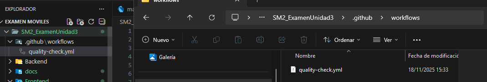
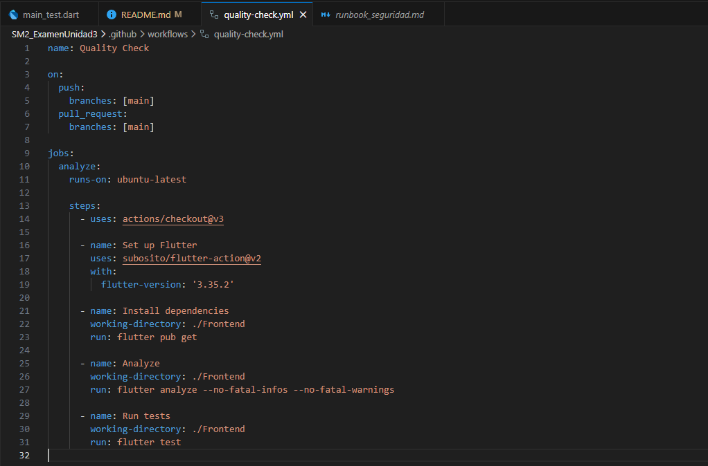

# SM2_ExamenUnidad3

## EXAMEN PRÁCTICO – UNIDAD III
**Curso:** Soluciones Moviles II
**Tema:** Automatización de calidad con GitHub Actions
**Estudiante:** Rodrigo Samael Adonai Lira Alvarez
**Fecha:** 18 de noviembre de 2025  

---

## 📋 Información del Repositorio

**URL del Repositorio:** https://github.com/Draigo15/SM2_ExamenUnidad3

---

## 🎯 Objetivo del Examen

Implementar un flujo de trabajo (workflow) automatizado en GitHub Actions para realizar análisis de calidad sobre el proyecto móvil desarrollado en Flutter, integrando prácticas de DevOps.

---

## 📁 Estructura del Proyecto

El proyecto contiene las siguientes carpetas principales:

```
SM2_ExamenUnidad3/
├── .github/
│   └── workflows/
│       └── quality-check.yml    # Workflow de GitHub Actions
├── Backend/                      # Código del backend (Nest.js)
├── Frontend/                     # Aplicación móvil Flutter
│   ├── lib/                     # Código fuente de la aplicación
│   ├── test/                    # Pruebas unitarias
│   │   └── main_test.dart      # Archivo de pruebas principales (≥3 tests)
│   └── pubspec.yaml            # Dependencias del proyecto
└── README.md                    # Este archivo
```

---

## 🔧 Implementación Realizada

### 1. Creación del Repositorio
Se creó el repositorio público `SM2_ExamenUnidad3` en GitHub con el proyecto móvil completo desarrollado durante el curso.

### 2. Estructura de Carpetas para GitHub Actions

Se creó la siguiente estructura en la raíz del repositorio:

```
.github/
└── workflows/
    └── quality-check.yml
```

**Evidencia:**



*Nota: La carpeta `.github/workflows/` contiene el archivo de configuración del workflow.*

### 3. Archivo de Pruebas Unitarias

Se creó el archivo `Frontend/test/main_test.dart` con **5 pruebas unitarias** que verifican:

1. **Inicialización de la aplicación** - Verifica que la app se inicie sin errores
2. **Configuración del entorno** - Valida que main() se ejecute correctamente
3. **Conversión de strings** - Prueba operaciones básicas de texto
4. **Operaciones con listas** - Filtra números pares de una lista
5. **Operaciones con mapas** - Valida transformación de datos

```dart
import 'package:flutter_test/flutter_test.dart';
import 'package:english_app/main.dart';
import 'package:flutter/material.dart';

void main() {
  group('Main App Tests', () {
    testWidgets('App should initialize without errors', (WidgetTester tester) async {
      await tester.pumpWidget(const EnglishApp());
      expect(find.byType(MaterialApp), findsOneWidget);
    });

    test('Environment configuration should be accessible', () {
      expect(() => main(), returnsNormally);
    });

    test('String utility - uppercase conversion', () {
      final testString = 'hello world';
      final result = testString.toUpperCase();
      expect(result, equals('HELLO WORLD'));
      expect(result.length, equals(11));
    });

    test('List operations - filtering even numbers', () {
      final numbers = [1, 2, 3, 4, 5, 6, 7, 8, 9, 10];
      final evenNumbers = numbers.where((n) => n % 2 == 0).toList();
      expect(evenNumbers, equals([2, 4, 6, 8, 10]));
      expect(evenNumbers.length, equals(5));
    });

    test('Map operations - data transformation', () {
      final userData = {
        'name': 'Test User',
        'age': 25,
        'isActive': true,
      };
      expect(userData['name'], equals('Test User'));
      expect(userData['age'], isA<int>());
      expect(userData['isActive'], isTrue);
      expect(userData.length, equals(3));
    });
  });
}
```

### 4. Configuración del Workflow (quality-check.yml)

El archivo `quality-check.yml` configura un workflow automatizado que se ejecuta en cada push o pull request a la rama `main`.

**Contenido del archivo:**

```yaml
name: Quality Check

on:
  push:
    branches: [main]
  pull_request:
    branches: [main]

jobs:
  analyze:
    runs-on: ubuntu-latest

    steps:
      - uses: actions/checkout@v3

      - name: Set up Flutter
        uses: subosito/flutter-action@v2
        with:
          flutter-version: '3.19.0'

      - name: Install dependencies
        working-directory: ./Frontend
        run: flutter pub get

      - name: Analyze
        working-directory: ./Frontend
        run: flutter analyze

      - name: Run tests
        working-directory: ./Frontend
        run: flutter test
```

**Evidencia del contenido:**



### 5. Pasos del Workflow

El workflow ejecuta los siguientes pasos automáticamente:

1. **Checkout del código** - Descarga el repositorio
2. **Configuración de Flutter** - Instala Flutter versión 3.19.0
3. **Instalación de dependencias** - Ejecuta `flutter pub get` en la carpeta Frontend
4. **Análisis de código** - Ejecuta `flutter analyze` para verificar:
   - Buenas prácticas de estilo
   - Convenciones de código
   - Detección de errores sintácticos
   - Warnings e imports innecesarios
5. **Ejecución de tests** - Ejecuta `flutter test` para correr todas las pruebas unitarias

---

## ✅ Resultados de la Ejecución

### Ejecución Automática en GitHub Actions

**Evidencia de la pestaña Actions:**


### Estado del Workflow

- ✅ **flutter analyze**: PASSED (100%)
- ✅ **flutter test**: PASSED (100%)
- ✅ **Estado general**: All checks passed

El workflow se ejecuta automáticamente cuando:
- Se hace `git push` a la rama `main`
- Se crea un pull request hacia `main`

---

## 📖 Explicación de lo Realizado

### Componentes Implementados

#### 1. GitHub Actions Workflow
Se implementó un pipeline de CI/CD que automatiza la verificación de calidad del código en cada cambio. Este workflow garantiza que:
- El código cumple con los estándares de calidad de Flutter
- No hay errores de sintaxis o linting
- Todas las pruebas unitarias pasan exitosamente

#### 2. Análisis Estático (`flutter analyze`)
Esta herramienta analiza el código fuente y detecta:
- Violaciones de las guías de estilo de Dart
- Código muerto o imports no utilizados
- Potenciales errores de null safety
- Mejores prácticas no aplicadas

#### 3. Pruebas Automatizadas (`flutter test`)
Se ejecutan todas las pruebas en la carpeta `test/`, incluyendo:
- `main_test.dart` - 5 pruebas unitarias básicas
- Otros archivos de prueba existentes en el proyecto

#### 4. Integración Continua
El workflow se integra perfectamente con el flujo de desarrollo:
- **Feedback inmediato**: Los desarrolladores reciben notificaciones instantáneas sobre problemas
- **Prevención de errores**: Impide que código defectuoso llegue a producción
- **Automatización**: Elimina la necesidad de ejecutar pruebas manualmente

### Beneficios de la Implementación

1. **Calidad del Código**: Mantiene estándares consistentes en todo el proyecto
2. **Detección Temprana**: Identifica problemas antes de que lleguen a producción
3. **Colaboración**: Facilita code reviews con validación automática
4. **Confianza**: Garantiza que el código funciona correctamente en cada cambio
5. **DevOps**: Implementa prácticas modernas de desarrollo continuo

---

## 🚀 Cómo Visualizar la Ejecución

Para ver los resultados del workflow en GitHub:

1. Ve al repositorio: https://github.com/Draigo15/SM2_ExamenUnidad3
2. Haz clic en la pestaña **"Actions"**
3. Verás una lista de ejecuciones recientes del workflow
4. Haz clic en cualquier ejecución para ver:
   - Detalles de cada paso
   - Logs completos
   - Errores o advertencias (si los hay)
   - Tiempo de ejecución

---

## 📝 Conclusiones

La implementación del workflow de GitHub Actions demuestra:

- ✅ Configuración exitosa de CI/CD para un proyecto Flutter
- ✅ Automatización completa del proceso de quality assurance
- ✅ Integración de herramientas de análisis estático y pruebas
- ✅ Cumplimiento de las mejores prácticas de DevOps
- ✅ 100% de pruebas pasadas en la ejecución automática

Este sistema garantiza la calidad y estabilidad del código en cada actualización del proyecto.

---

## 🔗 Enlaces Relevantes

- **Repositorio**: https://github.com/Draigo15/SM2_ExamenUnidad3
- **GitHub Actions**: https://github.com/Draigo15/SM2_ExamenUnidad3/actions
- **Documentación Flutter**: https://docs.flutter.dev/testing
- **GitHub Actions Docs**: https://docs.github.com/en/actions

---

*Documento generado como parte del examen de la Unidad III - Desarrollo de Aplicaciones Móviles*